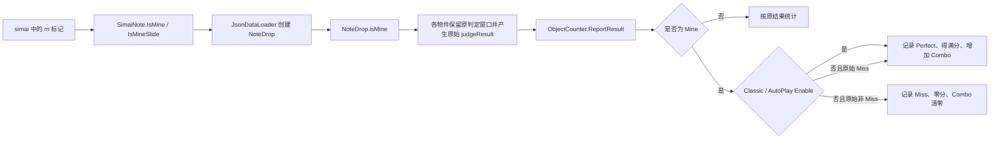

# Mine 功能与实现细节

本文档记录当前项目中 Mine 物件从谱面解析、数据装载、视觉绘制、判定反转、计分统计到各物件生命周期的完整实现。文中描述以 2026-07-18 的当前代码为准。

> 功能核对基线：主仓库 `master` 分支 `30aeb5373cdb` 及其后的 Classic Mine 判定调整，MajSimaiX 子模块 `10095cfc350d`。Mine 解析功能最初由 MajSimaiX `0420dde` 引入；本文档提交本身不包含在上述代码基线中。

## 1. 功能定义

Mine 沿用对应普通物件原有的移动、判定窗口和生命周期。在 DJAuto、Random 和 Disabled 模式下，最终计分规则与普通物件相反：

| 物件产生的原始判定 | Mine 最终记录 | 得分 | Combo |
| --- | --- | --- | --- |
| `JudgeType.Miss` | `JudgeType.Perfect` | 满分 | 增加 |
| 任意非 `Miss` 判定 | `JudgeType.Miss` | 0 | 清零 |

“任意非 `Miss`”包含所有 Perfect、Great、Good 以及 Fast/Late 变体。成功 Mine 最终固定记录为精确的 `JudgeType.Perfect`，不会记录为 Fast/Late。

Classic 是上述反转规则的特例。编辑器的 `EditorPlayMethod.Classic` 映射为运行时 `AutoPlayMode.Enable`；该模式下 Mine 不再反转 AutoPlay 产生的原始 Perfect，而是无条件将最终结果记录为 `JudgeType.Perfect`，获得满分并增加 Combo。

需要注意，当前实现反转的是物件最终产生的原始判定，并不是额外维护一个“是否触碰”布尔值。因此更准确的定义是：

- 原始判定为 Miss：Mine 成功。
- 原始判定不是 Miss：Mine 失败。
- Classic 模式：无论传入的原始判定为何，Mine 最终固定成功。
- 普通物件完全不受此规则影响。
- Mine 自身保存的 `judgeResult` 仍是原始判定，只有进入统计系统时才会被反转。

Mine 支持 Tap、Star、Hold、Touch、TouchHold、Slide 和 Wifi。Slide/Wifi 的星头与滑条本体是两个独立逻辑物件，可以分别设置为 Mine 并分别结算。

## 2. 谱面语法与解析

### 2.1 数据标记

解析结果由 [`SimaiNote`](../Assets/Plugins/MajSimaiX/Runtime/SimaiNote.cs) 中的两个字段表达：

- `IsMine`：普通物件或 Slide/Wifi 星头是否为 Mine。
- `IsMineSlide`：Slide/Wifi 滑条本体是否为 Mine。

当托管结构转换为 [`UnmanagedSimaiNote`](../Assets/Plugins/MajSimaiX/Runtime/Unmanaged/UnmanagedSimaiNote.cs) 时，这两个值会分别复制到 `isMine` 和 `isMineSlide`，因此经过非托管解析/缓存路径后不会丢失 Mine 身份。

解析器位于 [`SimaiNoteParser`](../Assets/Plugins/MajSimaiX/Runtime/SimaiNoteParser.cs)。`m` 标记按从左到右的上下文解析：

- 普通非 Slide 物件上的 `m` 设置 `IsMine`。
- Slide/Wifi 第一个滑动符号出现前的 `m` 设置星头 `IsMine`。
- Slide/Wifi 滑动符号之后、时值 `[` 之前的 `m` 设置本体 `IsMineSlide`。
- Slide/Wifi 最末尾的 `m` 也设置本体 `IsMineSlide`。

### 2.2 语法示例

| 目标 | 示例 | 解析结果 |
| --- | --- | --- |
| Tap Mine | `1m` | `IsMine = true` |
| Hold Mine | `1hm[4:1]` | `IsMine = true` |
| 强制 Star Mine | `1m$` | `IsMine = true` |
| Touch Mine | `B1m` | `IsMine = true` |
| TouchHold Mine | `B1hm[4:1]` | `IsMine = true` |
| 仅 Slide 星头 Mine | `1m-3[8:1]` | `IsMine = true` |
| 仅 Slide 本体 Mine | `1-3m[8:1]` | `IsMineSlide = true` |
| 仅 Slide 本体 Mine（尾标记） | `1-3[8:1]m` | `IsMineSlide = true` |
| Slide 星头和本体均为 Mine | `1m-3m[8:1]` | 两个字段均为 `true` |
| 仅 Wifi 星头 Mine | `1mw5[8:1]` | `IsMine = true` |
| 仅 Wifi 本体 Mine | `1w5m[8:1]` | `IsMineSlide = true` |

`m` 可以与 `b`、`x` 等标记共存。但运行时对同一个逻辑部分进行分类、绘制和计分时，Mine 优先于 Break、EX 等样式。组合标记不会使一个逻辑部分重复计数。

补充语法规则：

- Mine Hold 必须同时包含 `h`，例如短 Hold `1hm`、带时值 Hold `1hm[4:1]` 或 `1mh[4:1]`。
- MajSimaiX `README.md` 将 `1bm`、`1mb` 列在 Hold Mine 示例下，但这两个写法都没有 `h`；按当前解析器实际会得到 Tap（同时带 Break 和 Mine），不能用作 Hold。
- 中心 Touch Mine 使用 `Cm`，中心 TouchHold Mine 可写为 `Chm[4:1]`。
- 强制 Star Mine 可写为 `1m$` 或 `1$m`，假旋转强制 Star Mine 可写为 `1m$$`。
- FixedSoflan 可与 Mine Tap/Star 星头组合，例如 `1m@`、`1m@600`、`1m@-3[8:1]`、`1m@600-3[8:1]`。
- 对 Slide/Wifi 本体而言，位于滑动符号之后的 `m` 只有在紧邻 `[` 或位于整个 token 最后时才会设置 `IsMineSlide`。例如 `1-3m-5[8:1]` 中的 `m` 不满足该条件，不能用于标记某一个连接段。

### 2.3 Slide 的头和本体

Slide/Wifi 必须区分星头和本体：

```text
1m - 3m [8:1]
^^    ^
头    本体
```

- 星头由 `IsMine` 控制，作为 Tap/Star 类物件结算。
- 本体由 `IsMineSlide` 控制，作为 Slide/Wifi 类物件结算。
- 两者都为 Mine 时，`mineSum` 增加 2，并产生两次独立结果。
- 无星头 Slide 的头部不会被计数或上报；其 Mine 本体仍然有效。

连接 Slide 拆分为多个内部段时，Mine 标记会复制到各段。除第一段外的段会标为无星头，且只有连接组最后一段上报本体结果，因此一条连接 Slide 的 Mine 本体只结算一次。

`IsMineSlide` 是整条 Slide token 的单一布尔标记，不能只把连接 Slide 的某个内部路径段设为 Mine。与此不同，使用 `*` 创建的同头多 Slide 会解析为多个独立 Slide：`1-3m[8:1]*-5[8:1]` 只把第一条本体设为 Mine，`1-3[8:1]*-5m[8:1]` 则只把第二条本体设为 Mine。

## 3. 运行时数据流



[`JsonDataLoader`](../Assets/Scripts/JsonDataLoader.cs) 将解析字段映射到运行时对象：

- Tap、Hold、Touch、TouchHold：`NDCompo.isMine = note.IsMine`。
- Slide/Wifi 星头：`NDCompo.isMine = note.IsMine`。
- Slide 本体：`SliCompo.isMine = note.IsMineSlide`。
- Wifi 本体：`WifiCompo.isMine = note.IsMineSlide`。

所有物件最终通过基类 [`NoteDrop`](../Assets/Scripts/Notes/NoteDrop.cs) 的 `isMine` 字段向绘制和统计逻辑暴露 Mine 身份。

## 4. 数量统计、Each 与完成条件

### 4.1 Mine 计数优先级

`JsonDataLoader.CountNoteSum` 对每个逻辑部分按以下优先级分类：

1. Mine；
2. Break；
3. 普通物件类别。

具体规则为：

- 非 Slide 物件：`IsMine` 时计入 `mineSum`，不再计入 Break 或普通类别。
- Slide/Wifi 星头：非无头且 `IsMine` 时计入 `mineSum`。
- Slide/Wifi 本体：`IsMineSlide` 时计入 `mineSum`。
- 同时为 Mine 的星头和本体分别计数。

### 4.2 统计字段含义

[`ObjectCounter`](../Assets/Scripts/UI/ObjectCounter.cs) 中 Mine 相关字段的含义如下：

| 字段 | 含义 |
| --- | --- |
| `mineSum` | 谱面中需要结算的 Mine 逻辑物件总数 |
| `mineCount` | 已经完成结算的 Mine 数量，无论成功或失败 |
| `judgedMineCount` | 按反转后的最终结果保存的 Mine 判定数量 |
| `SuccessfulMineCount` | `judgedMineCount[JudgeType.Perfect]`，即成功 Mine 数量 |

`mineCount` 是进度值，不是得分值。侧边统计中的 `MIN` 显示 `mineCount / mineSum`，总完成进度 `ALL` 也包含 Mine。`AllFinished` 会额外要求 `mineCount == mineSum`。

### 4.3 Each、EachLine 和 Touch 分组

Mine 不参与普通 Each 表现：

- Mine 星头不会设置为普通 `isEach`。
- EachLine 会排除 Touch、TouchHold、Mine 星头和无星头 Slide。
- Mine Touch 不会加入 Touch 分组，其 `GroupInfo` 保持为空。
- Mine Slide/Wifi 本体不参与本体 Each 判定。
- 如果 Slide 星头正常而仅本体为 Mine，星头自身仍可成为 Each 并显示 EachLine。
- 同位置多 Slide 的双星判定仍按原规则工作，最终选中的双星 Sprite 再执行灰白映射。

例如 `1m/2` 只有一个非 Mine 物件，因此 `2` 不会仅因为与 Mine 同时出现而套用 Each 样式；`1m/2/3` 中的 `2` 和 `3` 会互相构成 Each，而 `1m` 本身仍不显示 Each 样式或 EachLine。

## 5. 判定反转与计分

### 5.1 唯一反转入口

Mine 的二值反转集中在 `ObjectCounter.ReportResult`：

```csharp
var isClassicAutoPlay = InputManager.Mode == AutoPlayMode.Enable;
var recordedResult = result;
if (note.isMine)
{
    recordedResult = isClassicAutoPlay || result == JudgeType.Miss
        ? JudgeType.Perfect
        : JudgeType.Miss;
}
```

后续所有正式统计统一使用 `recordedResult`，包括：

- `judgedMineCount`；
- 总判定数量；
- Perfect/Miss 数量；
- Combo；
- 准确率与各计分制当前得分。

物件内部的原始 `judgeResult` 不会被改写。这让各物件继续沿用原有判定窗口和销毁条件，同时把反转规则限制在统计边界内。

### 5.2 Combo 和结果桶

- 成功 Mine 进入精确 Perfect 桶，增加 Combo，不产生 Fast/Late 统计；Classic 下所有 Mine 都进入此分支。
- 失败 Mine 进入 Miss 桶，得分为 0，并将 Combo 清零。
- Mine 与 Break 标记共存时，传入计分逻辑的 Break 状态会被屏蔽，不计算 Break 奖励。
- `judgedMineCount` 虽然具备 Great/Good 等桶，但按当前二值反转路径，这些结果不会成为 Mine 的最终统计结果。

### 5.3 各计分制权重

| 计分制 | 每个 Mine 的总分分母 | 成功 Mine 当前得分 | 失败 Mine 当前得分 |
| --- | ---: | ---: | ---: |
| FiNALE | 500 | 500 | 0 |
| DX | 1 | 1 | 0 |
| DX EX | 3 | 3 | 0 |

准确率基础分同样将每个 Mine 按 500 分处理。各分母始终按 `mineSum` 计算，而当前得分只使用 `SuccessfulMineCount`。因此已结算数量 `mineCount` 不能代替成功数量参与得分。

## 6. 灰白视觉实现

### 6.1 材质应用

Mine 没有单独的 Sprite 或 Prefab。它仍使用当前皮肤选出的普通 Sprite，再由 `NoteDrop.ApplyMineVisual` 将目标 `SpriteRenderer.sharedMaterial` 切换为：

- 材质：[`MineSpriteMaterial.mat`](../Assets/Resources/MineSpriteMaterial.mat)
- Shader：[`MineSpriteEffect.shader`](../Assets/MineSpriteEffect.shader)

材质通过 `Resources.Load<Material>("MineSpriteMaterial")` 静态缓存。使用 `sharedMaterial` 避免为每个渲染器实例化独立材质。渲染器为空或资源加载失败时会静默跳过，不影响物件逻辑。

### 6.2 灰白映射

Shader 使用 Rec.709 权重计算亮度：

```text
luminance = dot(rgb, (0.2126, 0.7152, 0.0722))
gray      = lerp(0.58, 1.00, saturate(luminance))
rgb       = gray * alpha
```

材质参数当前为：

- `_GrayFloor = 0.58`
- `_GrayCeiling = 1.0`

因此结果是保留纹理透明轮廓的灰白色，而不是从纯黑开始的全范围灰度。Shader 使用预乘 Alpha 输出，并以 `One / OneMinusSrcAlpha` 混合。

### 6.3 样式优先级

- Mine 优先于 Each、Break 的普通样式。
- Mine + Break 不显示 Break 材质、闪光或额外计分。
- Mine + EX 不显示 EX 覆盖层。
- Star 的双星 Sprite 可以先按原逻辑选中，随后再映射成灰白色。
- Slide/Wifi 本体会先选择普通条体 Sprite，再应用 Mine 材质。

## 7. 各物件支持细节

| 物件 | 灰白覆盖范围 | 结算位置 | Mine 时屏蔽的结果/特效 |
| --- | --- | --- | --- |
| Tap | 主体、Tap Line、EX Renderer | `TapBase.OnDestroy` | 判定特效、Fast/Late |
| Star/强制 Star | 星体、Line、EX Renderer | 星头沿用 `TapBase.OnDestroy` | 判定特效、Fast/Late |
| Hold | 主体、Line、尾部、EX Renderer | `HoldDrop.OnDestroy` | 判定/FastLate、按压反馈、ResetEffect、Hold 闪光 |
| Touch | 7 个扇区 Renderer | `TouchDrop.OnDestroy` | Just Effect、Judge Effect、烟花 |
| TouchHold | 6 个 Renderer | `TouchHoldDrop.OnDestroy` | Hold 反馈、Judge Effect、烟花、Miss 边框 |
| Slide | 引导星与全部 Bar | 最终 Slide 段销毁时 | `slideOK` 判定对象、Break 闪光 |
| Wifi | 3 个引导星与全部 Bar | `WifiDrop.OnDestroy` | `slideOK` 判定对象、Break 闪光 |

对应实现文件：

- [`TapBase.cs`](../Assets/Scripts/Notes/TapBase.cs)
- [`TapDrop.cs`](../Assets/Scripts/Notes/TapDrop.cs)
- [`StarDrop.cs`](../Assets/Scripts/Notes/StarDrop.cs)
- [`HoldDrop.cs`](../Assets/Scripts/Notes/HoldDrop.cs)
- [`TouchDrop.cs`](../Assets/Scripts/Notes/TouchDrop.cs)
- [`TouchHoldDrop.cs`](../Assets/Scripts/Notes/TouchHoldDrop.cs)
- [`SlideDrop.cs`](../Assets/Scripts/Notes/SlideDrop.cs)
- [`WifiDrop.cs`](../Assets/Scripts/Notes/WifiDrop.cs)

### 7.1 Hold 的按压状态

Hold 按下、松开时会切换 Sprite。Mine 分支会在这些状态变化后继续应用灰白材质，确保按住期间不会恢复为彩色。Mine Hold 同时关闭普通按压反馈和 Hold 闪光 Animator。

### 7.2 Touch 与 TouchHold

Touch Mine 在普通和 Soflan 两条更新路径中都不会激活 `justEffect`。TouchHold Mine 停止时保留普通 `touchHoldBoard`，不会切换到 Miss 边框。两者仍正常执行传感器解绑、生命周期结束和结果上报。

### 7.3 Slide、Wifi 与连接 Slide

Mine Slide/Wifi 仍按原路径计算原始判定和完成滑动，但销毁时直接移除 `slideOK` 判定显示对象。连接 Slide 的中间段不报告结果，只有组末段报告一次；引导星和各段 Bar 均使用灰白材质。

### 7.4 无星头与同头多 Slide

- 无星头 Slide 不产生额外星头结果，因此即使内部复制了 `IsMine`，也不会产生幽灵 Mine 计数。
- 同头多 Slide 的每个滑条本体仍是独立逻辑物件；每个 `IsMineSlide` 分别计数和结算。
- 同头星头的普通双星外观逻辑保留，然后由 Mine 材质统一映射颜色。

## 8. 判定显示和特效抑制

Mine 不向玩家显示判定结果及其附属特效，但这不代表不进行内部判定：

- 不播放普通 Judge、Fast/Late、Just、烟花、Hold 反馈等效果。
- Slide/Wifi 不显示 `slideOK`。
- Mine + Break 不播放 Break 闪光。
- 内部原始判定仍用于决定反转后的正式结果。
- 某些类保留的调试日志不属于玩家可见的判定特效。
- 物件仍会正常销毁、解绑输入、更新进度并调用统计入口。

## 9. AutoPlay、Soflan、速度与重载

### 9.1 AutoPlay 的当前行为

- 编辑器 `EditorPlayMethod.Classic` 映射为 `AutoPlayMode.Enable`。该模式为物件生成原始 Perfect，Mine 在统计入口使用 Classic 特例，最终仍记录为 Perfect、获得满分并增加 Combo。
- `AutoPlay.Random` 当前使用 `UnityEngine.Random.Range(1, 14)`。整数重载的上限不包含 14，实际只会得到 1～13，而 `JudgeType.Miss` 的值为 0。因此 Random 当前也不会随机出原始 Miss，Mine 最终全部为 Miss。
- DJAuto 通过模拟输入产生判定，通常得到非 Miss，随后按相同规则反转。

如果期望 Random 模式中 Mine 有机会成功，需要另行调整原始随机判定范围；这不属于当前 Mine 反转逻辑本身。

### 9.2 Soflan 与速度机制

Mine 没有独立的移动速度或时间轴分支。它继承所属物件当前的速度机制，Soflan/HS/SV 只影响物件原有运动或显示时间，不改变 Mine 的最终反转规则。

`JsonDataLoader.SetNoteSpeed` 将用户速度换算为 `noteSpeedValue = (editorNoteSpeed + 1) * 100`。当前各部分的使用情况如下：

| 对象部分 | 当前速度/时间机制 | Mine 的额外处理 |
| --- | --- | --- |
| Tap、Star 及 Slide/Wifi 星头 | `TapBase.GetTapDistance/GetTapScale` 的 `noteSpeedValue` 曲线；可使用 FixedSoflan | 只增加灰白绘制与计分反转 |
| Hold | 正常和 Soflan 路径均使用 `TapBase` 距离/缩放曲线及 `noteSpeedValue` | 不改变时间，只维持各按压 Sprite 的灰白材质 |
| EachLine | 使用与 `TapBase` 一致的距离/缩放曲线 | Mine 星头不会生成 Mine EachLine |
| Touch、TouchHold | 沿用独立的 Touch 移动速度和 Soflan 路径 | 不改变时间机制 |
| Slide、Wifi 本体 | 沿用各自的 SlideStartTime、SlideTime、进度和 Soflan 路径 | 不改变滑动时间或判定窗口 |

Hold 和 EachLine 从旧的线性 `timing * speed + 4.8` 方式切换到上述 `TapBase` 新曲线的改动记录在提交 `cd72334`。Mine Hold 自动继承该变化，没有额外的旧速度兼容分支。

固定 Soflan 标记 `@` 可以与 Mine Tap/Star 星头组合：星头按固定速度运动并绘制为灰白色。它不会因此改变 Mine Slide 本体、Hold 或 Touch 等其他类别的速度规则。

### 9.3 重载保护

各物件的销毁上报路径会检查 `HttpHandler.IsReloding`；重载期间销毁的物件不会被计入结果。Slide/Wifi 还保留各自的内部销毁保护，避免重载或连接段清理产生重复结算。

### 9.4 Unity 导入与独立验证项目

MajSimaiX 的命令行验证项目位于 [`Validation~`](../Assets/Plugins/MajSimaiX/Validation~/MajSimai.SVValidation.csproj)。目录名以 `~` 结尾后，Unity 不会导入其中的 `.cs` 和 `.csproj`，因此这些验证代码不会进入 `Assembly-CSharp`，也不会再造成 Unity 自动生成项目中的重复编译问题。

该项目仍可作为 .NET 8 控制台项目独立运行，但当前用例面向 HS/SV 解析，没有 Mine 专项用例；它不能替代本文的 Mine 全类型人工回归清单。

## 10. 当前边界与已知注意事项

1. **AutoPlay Random 不会产生成功 Mine。** 当前随机范围不包含原始 Miss。
2. **从中途开始或跳过前段时，Mine 当前分数可能与进度语义不同。** `CountNoteCount` 会为被跳过的 Mine 增加 `mineCount`，使进度和 `AllFinished` 正确，但不会同步增加 `judgedMineCount[Perfect]`。因此跳过的 Mine 不会进入 `SuccessfulMineCount`，也不会贡献当前分数或 Mine 准确率。
3. **灰白材质缺失时会静默退化。** `Resources.Load` 失败不会中断物件，只会使其保持原材质，可能导致 Mine 视觉不可辨识。
4. **除 Classic 特例外，反转的是原始结果，不是直接触碰事件。** 如果某种输入最终仍产生原始 Miss，它会作为成功 Mine；只要最终原始结果是非 Miss，就会作为失败 Mine。Classic 下不检查原始结果，统一记为 Perfect。
5. **Slide 标记位置有实际语义。** `IsMine` 与 `IsMineSlide` 分别控制头和本体，错误放置 `m` 会改变被设为 Mine 的逻辑部分。
6. **Mine 的 Great/Good 统计分支当前不可达。** 统一反转后只有 Perfect 或 Miss 两种最终结果。
7. **当前没有发现专门覆盖 Mine 全类型的自动化测试套件。** 修改相关逻辑后应执行下述人工回归。

## 11. 回归验证清单

### 11.1 判定与计分

- 普通物件的原始和最终判定完全一致。
- 每类 Mine 原始 Miss 后记录精确 Perfect、得到满分并增加 Combo。
- 每类 Mine 原始 Perfect、Great、Good 或任意 Fast/Late 后记录 Miss、得 0 分并清空 Combo。
- FiNALE、DX、DX EX 和准确率只按成功 Mine 增加当前得分，分母始终包含全部 `mineSum`。
- Mine + Break 不获得 Break 奖励。

### 11.2 类型覆盖

- Tap、强制 Star、普通 Star 星头。
- Hold，并覆盖未按、短按、完整按住及按住期间的灰白外观。
- Touch、TouchHold。
- Slide、Wifi 的仅头 Mine、仅本体 Mine、头和本体同时 Mine。
- 无星头 Slide、同头多 Slide、连接 Slide，确认每个逻辑部分只结算一次。

### 11.3 显示与生命周期

- 所有 Mine Sprite 均为灰白色，皮肤轮廓和透明度正常。
- Hold 按住和松开时不恢复彩色。
- 不出现 Judge、Fast/Late、Just、烟花、Hold 反馈、Break 闪光或 `slideOK`。
- Mine 正常销毁、解绑传感器并推进 `MIN` 和 `ALL`。
- 重载期间不产生 Mine 结果。

### 11.4 模式与工具检查

- EditorPlayMethod.Classic / AutoPlay Enable 下 Mine 全部最终 Perfect、获得满分并增加 Combo。
- AutoPlay Random 下验证当前范围不会产生原始 Miss。
- 普通速度、Soflan、固定 Soflan 下的 Mine 均沿用对应物件时间机制。
- 执行 `git diff --check`。
- 执行 `dotnet build Assembly-CSharp.csproj --no-restore`。
- 检查 Unity 自动编译日志，确认没有脚本或 Shader 编译错误。

## 12. 相关实现历史

| 提交 | 内容 |
| --- | --- |
| MajSimaiX `0420dde` | 增加 Mine 谱面标记和解析字段 |
| `fae0b18` | 增加 Mine 物件灰白绘制与计分基础支持 |
| `b3d66ed` | 保持 Mine Hold 在按住过程中的灰白效果 |
| `6fafb7b` | 反转 Mine 统计结果并屏蔽判定显示/特效 |
| `cd72334` | Hold 和 EachLine 切换为与 Tap 对齐的新速度时间曲线，Mine Hold 同步继承 |
| MajSimaiX `10095cf` / 主仓库 `30aeb53` | 将独立验证项目移入 `Validation~`，排除 Unity 导入 |

## 13. 核心代码索引

- 谱面数据结构：[`SimaiNote.cs`](../Assets/Plugins/MajSimaiX/Runtime/SimaiNote.cs)
- 非托管谱面数据结构：[`UnmanagedSimaiNote.cs`](../Assets/Plugins/MajSimaiX/Runtime/Unmanaged/UnmanagedSimaiNote.cs)
- 谱面标记解析：[`SimaiNoteParser.cs`](../Assets/Plugins/MajSimaiX/Runtime/SimaiNoteParser.cs)
- MajSimaiX 支持清单与语法示例：[`README.md`](../Assets/Plugins/MajSimaiX/README.md)
- MajSimaiX 独立 HS/SV 验证项目：[`MajSimai.SVValidation.csproj`](../Assets/Plugins/MajSimaiX/Validation~/MajSimai.SVValidation.csproj)
- 物件装载、分类、总数和连接 Slide：[`JsonDataLoader.cs`](../Assets/Scripts/JsonDataLoader.cs)
- Mine 运行时字段和材质入口：[`NoteDrop.cs`](../Assets/Scripts/Notes/NoteDrop.cs)
- 最终判定反转、分数、Combo 和进度：[`ObjectCounter.cs`](../Assets/Scripts/UI/ObjectCounter.cs)
- Mine Shader：[`MineSpriteEffect.shader`](../Assets/MineSpriteEffect.shader)
- Mine 材质：[`MineSpriteMaterial.mat`](../Assets/Resources/MineSpriteMaterial.mat)
